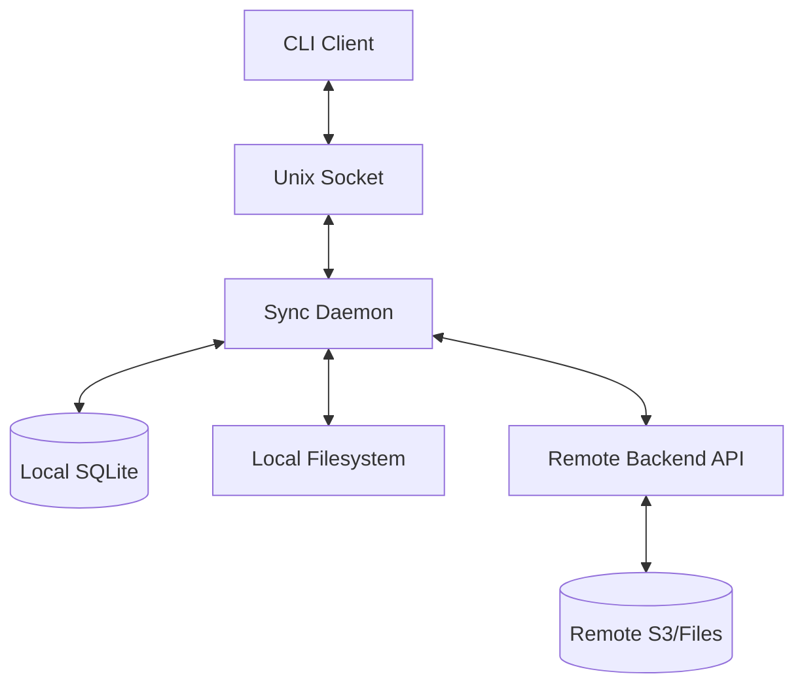

# RustShare Desktop Architecture Overview

## 1. System Context
The current desktop client is a CLI and background daemon that bridge the local filesystem and the RustShare API. The live sync path is the shared engine in `crates/sync-engine`, not the older experimental desktop-only sync modules.

## 2. Logical Components

### 2.1 Apps
- `rustshare-desktop`: The CLI and daemon (macOS/Windows). Responsible for auth, sync management, and background synchronization.

### 2.2 Sync Core (`crates/sync-engine`)
- **Sync Manager**: Owns the daemon lifecycle, scan-plan-execute loop, and root registration.
- **Planner**: Reconciles local, remote, and persisted DB state; orders directory creation, file transfer, deletes, and conflict handling.
- **Worker**: Executes uploads, downloads, and delete operations, including resumable uploads.
- **Local Scanner**: Crawls the workspace and produces local entries for planning.
- **Remote Discovery**: Builds remote file and folder state scoped to the configured sync root.
- **Socket Server**: Unix socket RPC server for CLI↔daemon communication.

### 2.3 Shared Crates
- `sync-domain`: Core data structures (e.g., `SyncRoot`, `RemoteFile`).
- `sync-protocol`: Shared API models and serialization/deserialization.
- `client-state`: SQLite persistence layer.
- `file-ops`: Cross-platform filesystem operations (atomic rename, checksum).
- `platform`: OS-specific logic (keychain access, path normalization).

## 3. Data Flow



## 4. Sync Pipeline
1. **Trigger**: FS Notify (local) or WebSocket/Poll (remote).
2. **Scan**: Identify current local files, directories, and remote root contents.
3. **Plan**: Reconcile local state, remote state, persisted file state, tombstones, and quarantine records.
4. **Execute**: Create directories first, then transfer files, then apply deletes.
5. **Commit**: Update SQLite file state, upload sessions, tombstones, and broken-remote quarantine entries.

## 5. Daemon Architecture

### 5.1 Communication
- **Transport**: Unix domain socket in the app-data directory as `daemon.sock`
- **Protocol**: JSON-RPC 2.0 over line-delimited JSON
- **Security**: Socket permissions set to 0600 (user-only access)

### 5.2 Process Management
- **PID File**: `daemon.pid` in the app-data directory tracks the running daemon
- **Lifecycle**: Explicit start/stop via CLI commands
- **Logging**: Daemon stdout/stderr redirected to `daemon.log`

On macOS, these files live under:

```text
~/Library/Application Support/io.rustshare.RustShare/
```

### 5.3 RPC Methods
| Method | Description |
|--------|-------------|
| `daemon.ping` | Health check |
| `daemon.stop` | Graceful shutdown |
| `sync.request` | Trigger sync for path |
| `sync.status` | Query sync status |
| `config.reload` | Notify of configuration change |

## 6. Security Boundaries
- **Transport**: TLS 1.2+ for all remote communication.
- **Local Socket**: Unix socket with 0600 permissions (user-only).
- **Tokens**: Stored in OS-native secure stores (Keyring/Mac Keychain), with a daemon-readable `token.txt` fallback in app-data.
- **Local FS**: Normal user-level permissions.
- **PID File**: Readable by user for status checks.
