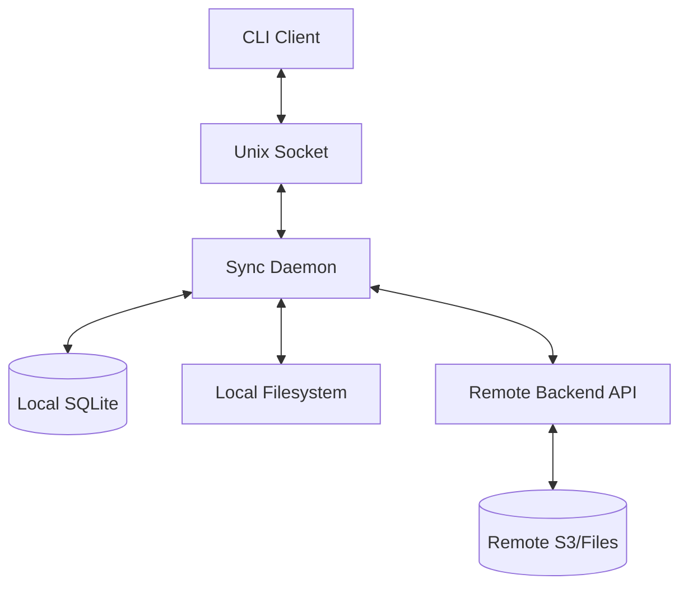

# RustShare Desktop Architecture Overview

## 1. System Context
The Desktop Client is a principal interface for the RustShare backend. It acts as a bridge between the local filesystem and the remote API, ensuring file parity.

## 2. Logical Components

### 2.1 Apps
- `rustshare-desktop`: The CLI and daemon (macOS/Windows). Responsible for auth, sync management, and background synchronization.

### 2.2 Sync Core (`crates/sync-engine`)
- **Worker/Dispatcher**: Manages the main sync loop.
- **Planner**: Reconciles local and remote changed sets; determines the required order of operations (CUD).
- **Scheduler**: Coordinates concurrent transfers (up/down).
- **Local Scanner**: Crawls the workspace to detect changes.
- **Remote Scanner**: Fetches delta updates from the backend using sync cursors.
- **Socket Server**: Unix socket RPC server for CLI↔Daemon communication.

### 2.3 Shared Crates
- `sync-domain`: Core data structures (e.g., `SyncRoot`, `RemoteFile`).
- `sync-protocol`: Shared API models and serialization/deserialization.
- `client-state`: SQLite persistence layer.
- `file-ops`: Cross-platform filesystem operations (atomic rename, checksum).
- `platform`: OS-specific logic (keychain access, path normalization).

## 3. Data Flow

## 4. Sync Pipeline
1. **Trigger**: FS Notify (local) or WebSocket/Poll (remote).
2. **Scan**: Identify current local state vs remote cursor.
3. **Plan**: Reconcile changes; identify conflicts.
4. **Queue**: Schedule transfers.
5. **Execute**: Download/Upload to temp, hash, then finalize.
6. **Commit**: Update the Local SQLite database with new state.

## 5. Daemon Architecture

### 5.1 Communication
- **Transport**: Unix domain socket at `~/.config/rustshare/daemon.sock`
- **Protocol**: JSON-RPC 2.0 over line-delimited JSON
- **Security**: Socket permissions set to 0600 (user-only access)

### 5.2 Process Management
- **PID File**: `~/.config/rustshare/daemon.pid` tracks running daemon
- **Lifecycle**: Explicit start/stop via CLI commands
- **Logging**: Daemon stdout/stderr redirected to `~/.config/rustshare/daemon.log`

### 5.3 RPC Methods
| Method | Description |
|--------|-------------|
| `daemon.ping` | Health check |
| `daemon.stop` | Graceful shutdown |
| `sync.request` | Trigger sync for path |
| `sync.status` | Query sync status |
| `config.reload` | Notify of configuration change |

## 6. Security Boundaries
- **Transport**: TLS 1.2+ for all remote communication.
- **Local Socket**: Unix socket with 0600 permissions (user-only).
- **Tokens**: Stored in OS-native secure stores (Keyring/Mac Keychain).
- **Local FS**: Normal user-level permissions.
- **PID File**: Readable by user for status checks.
