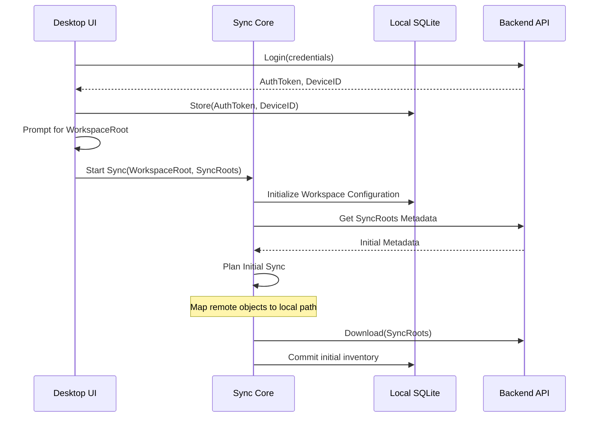
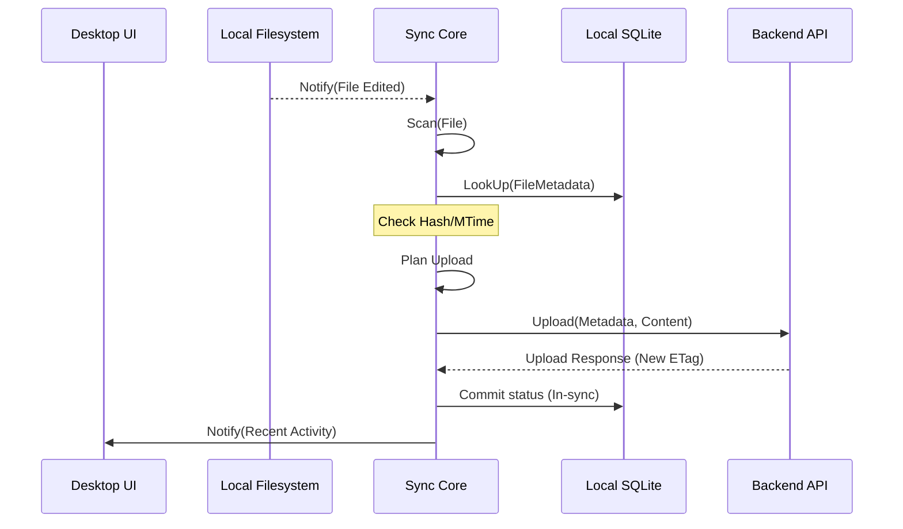
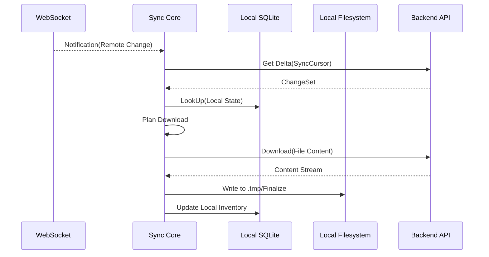
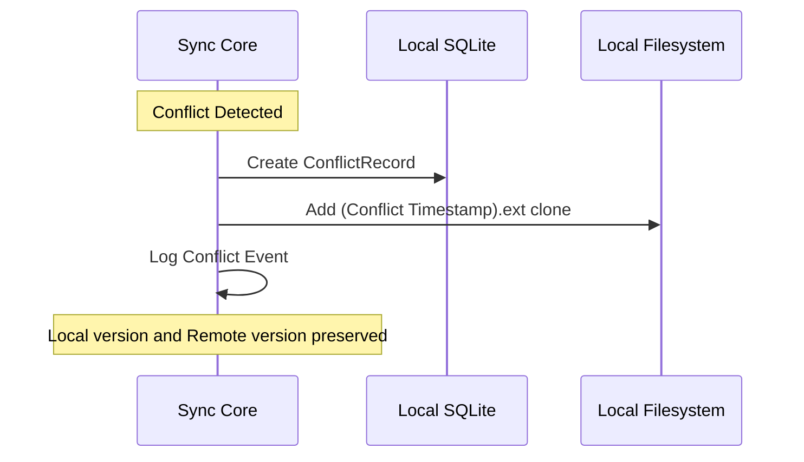
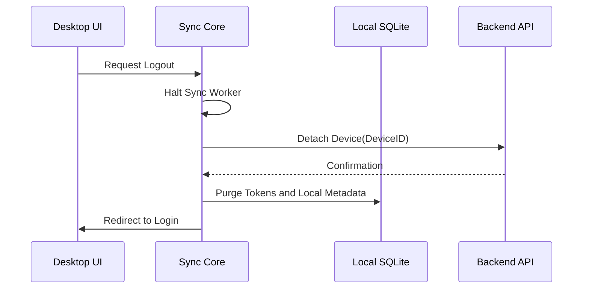

# RustShare Desktop Sequence Flows

## 1. First Login + Workspace Initialization

## 2. Local File Edit Sync (CUD)

## 3. Remote File Edit Apply

## 4. Conflict Generation

## 5. Logout / Device Detach

