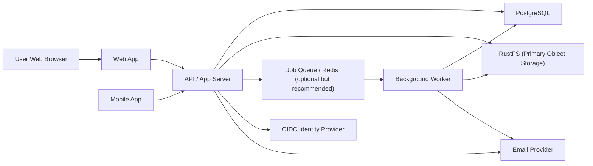

# File Sharing Lite Technical Architecture Specification

Date: 2026-03-19
Companion documents:

- `docs/2026-03-19-file-sharing-lite-mvp-spec.md`
- `docs/2026-03-19-file-sharing-lite-mvp-roadmap.md`

Status: Draft architecture specification

## 1. Architecture Goals

The system architecture must support a focused file-sharing MVP with:

- secure storage
- upload/download
- internal sharing
- public links
- simple permission inheritance
- OIDC SSO
- light mobile sync for photo and file upload

The architecture should optimize for:

- correctness
- implementation speed
- operational simplicity
- clear upgrade path

The architecture should **not** optimize for:

- extreme microservice decomposition
- plugin ecosystems
- complex distributed sync algorithms
- enterprise feature breadth in MVP-1

## 2. Architecture Principles

### Principle 1: Modular monolith first

Use a single deployable application for core business logic, with internal module boundaries.

Why:

- lower integration overhead
- easier transactions around metadata and sharing
- faster development for a small team
- simpler observability and deployment

### Principle 2: Separate metadata from blobs

Store metadata in PostgreSQL and file content in RustFS, used as the primary strictly consistent object store.

Why:

- clean transactional semantics for metadata
- scalable storage for file content
- simpler backup and restore strategies

### Principle 3: Server is source of truth

All clients sync against server state. No peer sync.

### Principle 4: Whole-file sync in MVP

Do not implement block-level sync in MVP-1.

Why:

- much lower complexity
- simpler correctness model
- easier mobile implementation

### Principle 5: OIDC is the only SSO protocol in MVP-1

Support one strong identity path instead of multiple partial ones.

## 3. System Context

The system includes:

- web frontend
- mobile apps
- API/backend
- PostgreSQL
- RustFS primary object storage
- background workers
- email provider
- OIDC identity provider

## 4. High-Level System Diagram



## 5. Deployment Topology

### Recommended MVP deployment

- 1 web/app service image
- 1 worker image
- 1 PostgreSQL instance
- 1 RustFS cluster or service as primary blob storage
- 0..N asynchronous replica targets managed by background workers
- optional Redis for queue/cache/distributed locks

### Environments

- local development
- shared staging
- production

### Production model

- app servers stateless
- worker stateless
- PostgreSQL managed or highly available
- RustFS as the authoritative primary blob store
- asynchronous replication to additional locations outside the request path

## 6. Runtime Components

## 6.1 Web Application

Responsibilities:

- user login via OIDC redirect flow
- file browser UI
- sharing UI
- upload UI
- admin settings UI

Architecture recommendation:

- server-rendered or hybrid SPA
- API consumption via REST/JSON
- no direct database access

## 6.2 Mobile Applications

Responsibilities:

- OIDC login via system browser
- file browse/search
- upload from camera/gallery/file picker
- offline-marked file downloads
- photo backup queue

Architecture recommendation:

- native apps or cross-platform framework with strong background-task support
- local queue + local metadata cache
- no attempt at arbitrary bi-directional filesystem sync

## 6.3 API / App Server

Responsibilities:

- auth/session validation
- file/folder metadata management
- permission enforcement
- share-link issuance and validation
- upload finalization
- admin policy enforcement
- audit event writing

## 6.4 Background Worker

Responsibilities:

- post-upload processing
- archive generation for folder downloads
- thumbnail/preview generation
- email notifications
- cleanup jobs
- expired-link cleanup

Recommendation:

- use a worker even in MVP if archives, previews, and emails exist

## 6.5 PostgreSQL

Responsibilities:

- transactional metadata
- permissions
- audit events
- upload sessions
- user/group state

## 6.6 Object Storage

Responsibilities:

- strictly consistent primary blob writes
- immutable file blob versions
- generated archives
- preview derivatives if stored persistently
- source content for asynchronous cross-location replication

## 6.7 Queue / Cache Layer

Recommendation:

- optional in the smallest deployment
- strongly recommended once background processing exists

Suggested uses:

- background jobs
- rate limiting state
- distributed locks for certain workflows
- short-lived caching

Redis is a reasonable MVP choice if needed.

## 7. Internal Module Design

The backend should be organized into internal modules.

Recommended modules:

- `identity`
- `users`
- `groups`
- `files`
- `folders`
- `uploads`
- `downloads`
- `sharing`
- `permissions`
- `notifications`
- `audit`
- `admin_policy`

### Module boundary rule

Business logic should live in modules/services, not in handlers/controllers.

## 8. Data Architecture

## 8.1 Core Entities

### User

Fields:

- id
- email
- display_name
- avatar_url nullable
- status
- quota_bytes nullable
- used_bytes cached
- created_at
- updated_at
- last_login_at

### Group

Fields:

- id
- name
- description nullable
- created_at
- updated_at

### GroupMember

Fields:

- group_id
- user_id
- role optional

### Folder

Fields:

- id
- parent_folder_id nullable
- owner_user_id
- name
- normalized_name
- path_cache optional
- deleted_at nullable
- created_at
- updated_at

### File

Fields:

- id
- parent_folder_id
- owner_user_id
- name
- normalized_name
- mime_type
- size_bytes
- checksum
- current_version_number
- deleted_at nullable
- created_at
- updated_at

### FileVersion

Fields:

- id
- file_id
- version_number
- object_key
- replication_state
- replication_queued_at nullable
- replication_completed_at nullable
- replication_error nullable
- size_bytes
- checksum
- created_by_user_id
- created_at

### InternalShare

Fields:

- id
- resource_type (`file` or `folder`)
- resource_id
- principal_type (`user` or `group`)
- principal_id
- permission_role
- granted_by_user_id
- created_at
- revoked_at nullable

### PublicLink

Fields:

- id
- resource_type
- resource_id
- token_hash
- permission_role
- password_hash nullable
- expires_at nullable
- upload_only boolean
- download_allowed boolean
- created_by_user_id
- created_at
- revoked_at nullable

### UploadSession

Fields:

- id
- uploader_user_id
- target_folder_id
- original_filename
- mime_type
- expected_size nullable
- checksum nullable
- status
- upload_protocol
- storage_staging_key
- created_at
- expires_at

### AuditEvent

Fields:

- id
- actor_user_id nullable
- event_type
- resource_type nullable
- resource_id nullable
- metadata jsonb
- ip_address nullable
- user_agent nullable
- created_at

## 8.2 Notes on Schema Design

Recommendations:

- prefer UUID primary keys
- use explicit soft-delete columns
- index by owner, parent folder, share principal, public-link token hash
- keep token hashes, not raw public tokens

## 9. File Storage Strategy

### Blob storage pattern

Store each file version as an immutable object in RustFS.

Object key pattern example:

- `tenant/default/files/{file_id}/{version_number}/{content_hash}`

Benefits:

- easy version retention
- simple rollback
- no in-place mutation
- Rustshare does not manage filesystem placement itself

### Primary write rule

- the Axum backend writes synchronously to RustFS
- the request succeeds only after the RustFS primary write succeeds
- the request does not wait for any secondary replication target

This is the critical boundary:

- RustFS is the primary blob system
- Rustshare owns metadata, permissions, and replication workflow state
- background workers own secondary copy creation

### Deletion model

On logical delete:

- metadata moves to trash state
- blobs remain referenced by versions

On purge:

- metadata removed
- orphaned blobs garbage-collected asynchronously after reference check

## 10. Upload Architecture

## 10.1 Required behavior

- support large files
- recover from network interruption
- support mobile uploads

## 10.2 Recommended flow

1. client uploads through app server in MVP
2. app server validates request and writes blob to RustFS
3. server validates checksum/size
4. server creates file + file_version metadata
5. server marks version `primary_written`
6. server enqueues asynchronous replication job
7. server returns success immediately after the primary RustFS write and metadata commit
8. background worker handles secondary replication and previews if needed

## 10.3 Direct-to-object-storage vs proxy-through-app

### Recommended default

Use app-proxied upload first so the Axum backend can own the exact moment the primary RustFS write succeeds.

Why:

- clearer correctness for MVP
- simpler session/cookie auth model
- easier replication-state bookkeeping

### When app proxy is acceptable

- small deployments
- small files
- simpler early local development

### Honest recommendation

If the team later needs larger throughput, it can move to server-issued signed upload instructions, but only if Rustshare still controls finalization and replication-state transitions.

## 10.4 Upload protocol

Recommended:

- TUS or signed multipart upload flow

The key requirement is resumability, not protocol purity.

## 11. Download Architecture

Download options:

- streamed download through app server
- short-lived signed RustFS URL

### Recommended policy

- internal downloads may use short-lived signed RustFS URLs where client simplicity allows
- public links should still pass through policy validation before any signed URL is issued

Folder download:

- request archive job
- background worker creates zip/tar
- client polls for readiness
- client downloads finished archive

## 12. Sync and Consistency Model

## 12.1 Sync semantics

Use item-level versioning:

- each file has current version number / etag
- clients compare known version with server version
- conflicting writes create conflict error or explicit new version according to action

## 12.4 Replication semantics

- primary write is synchronous to RustFS
- cross-location replication is strictly asynchronous
- version state starts at `primary_written`
- workers move state through `queued`, `syncing`, `fully_replicated`, `degraded`, or `failed`
- user success responses never wait for replica completion

## 12.2 Mobile semantics

### Supported in MVP

- one-way local-to-server photo backup
- explicit user-triggered uploads
- explicit offline download of selected files

### Not supported in MVP

- arbitrary bidirectional filesystem mirroring
- hidden background syncing of entire device storage

## 12.3 Conflict handling

Recommended MVP behavior:

- for normal replacement: server checks expected current version
- if mismatch, reject with conflict response
- client offers re-download or upload as new version if allowed

## 13. Permission Model Architecture

## 13.1 Roles

Internal roles:

- `viewer`
- `contributor`
- `editor`
- `manager`

Public-link roles:

- `public_viewer`
- `public_uploader`

## 13.2 Resolution order

Recommended order:

1. owner
2. direct user share
3. direct group share
4. inherited parent-folder share
5. no access

Recommended simplification:

- no explicit deny rules in MVP

## 13.3 Inheritance rules

- folder shares inherit downward
- child explicit share overrides inherited parent role
- user-specific share overrides group share

This is consistent with patterns documented in Seafile folder-permission behavior. Source-informed inference: keeping user-over-group and child-over-parent precedence reduces ambiguity and is operationally understandable.

## 14. Public Link Architecture

## 14.1 Public token design

Recommended:

- generate random opaque token
- store only token hash
- compare hash on lookup

## 14.2 Public link controls

Fields/controls:

- expiry
- password
- upload-only flag
- download permission flag
- max downloads optional later

## 14.3 Security notes

- do not expose predictable IDs
- rate-limit public-link access and password attempts
- log link access events
- ensure expiry is enforced on server, not only UI

## 15. OIDC Architecture

## 15.1 Web flow

Recommended:

- Authorization Code flow
- confidential backend or backend-assisted exchange
- secure session cookie for web app

## 15.2 Mobile flow

Recommended:

- Authorization Code + PKCE
- system browser or ASWebAuthenticationSession / custom tab equivalent
- refresh token storage in secure keychain/keystore

## 15.3 User provisioning

On first successful login:

- create local user record
- map groups from claims if configured
- set profile fields from IdP claims

## 15.4 Authorization model

Authentication comes from IdP.

Authorization remains local:

- local groups
- local shares
- local admin policy

This separation is important.

## 16. Notification Architecture

Recommended MVP model:

- write notification records into database
- trigger email asynchronously
- mobile/web poll for updates

Do not require real-time websocket notifications for MVP-1 unless product feedback proves it is necessary.

## 17. Search Architecture

Recommended MVP:

- PostgreSQL-backed search on file/folder names

Implementation:

- trigram or prefix/full-text index on names
- filter by accessible resources only

Do not introduce separate search infrastructure in MVP.

## 18. Preview Architecture

Recommended preview types in MVP:

- image
- PDF
- plain text

Optional if cheap:

- audio/video browser-native preview

Preview pipeline:

1. upload finalized
2. worker generates thumbnail/preview
3. metadata updated
4. client loads preview when available

## 19. API Design

## 19.1 API style

Recommended:

- REST/JSON
- explicit resource-oriented endpoints

### Core endpoints

- `POST /auth/oidc/exchange`
- `POST /sessions/refresh`
- `GET /me`
- `GET /folders/{id}/contents`
- `POST /folders`
- `PATCH /folders/{id}`
- `DELETE /folders/{id}`
- `POST /uploads/sessions`
- `POST /uploads/sessions/{id}/complete`
- `GET /files/{id}`
- `POST /files/{id}/download`
- `PATCH /files/{id}`
- `DELETE /files/{id}`
- `GET /files/{id}/versions`
- `POST /shares/internal`
- `PATCH /shares/internal/{id}`
- `DELETE /shares/internal/{id}`
- `POST /shares/public`
- `PATCH /shares/public/{id}`
- `DELETE /shares/public/{id}`
- `POST /public-links/{token}/access`
- `POST /public-links/{token}/upload`
- `GET /notifications`
- `GET /admin/policies/sharing`
- `PATCH /admin/policies/sharing`

## 19.2 API consistency rules

- use stable resource IDs
- return machine-readable error codes
- return permission-related errors explicitly
- include pagination in list APIs
- include etag/version values where clients need them

## 19.3 Error model

Recommended error shape:

```json
{
  "code": "share_permission_denied",
  "message": "You do not have permission to share this folder.",
  "request_id": "..."
}
```

## 20. Background Job Architecture

Recommended job types:

- `generate_preview`
- `create_archive`
- `send_email`
- `cleanup_expired_links`
- `purge_deleted_content`
- `recalculate_storage_usage`

Requirements:

- idempotent handlers
- retry with backoff
- dead-letter visibility

## 21. Observability

Required:

- structured logs
- request IDs
- audit event trail
- metrics for uploads/downloads/errors/queue depth

Useful metrics:

- upload session failure rate
- average upload finalize latency
- preview generation failure rate
- public-link access rate
- photo backup retry count

## 22. Security Architecture

Required controls:

- TLS everywhere
- secure cookie flags
- refresh token rotation
- least-privilege object storage credentials
- token hashing for public links
- password hashing for protected links
- rate limiting for auth and public links
- MIME and size validation
- antivirus hook point

### Threats to explicitly consider

- leaked public links
- brute-force on password-protected links
- confused-deputy access bugs in inherited permissions
- path traversal in archive/download generation
- incomplete cleanup of deleted data

## 23. Backup and Recovery Architecture

Required:

- PostgreSQL backups
- object storage durability or replication
- tested restore procedure
- documented restore ordering

Restore order recommendation:

1. restore database
2. restore object storage
3. run consistency verification
4. requeue missing derivative generation

## 24. Scalability Limits for MVP

The architecture should comfortably support:

- low thousands of users
- millions of metadata rows
- moderate large-file usage

The architecture is not optimized in MVP for:

- multi-region active-active
- petabyte-scale dedupe optimization
- tens of thousands of concurrent transfer-heavy users

## 25. Technology Recommendations

These are architectural recommendations, not hard requirements.

### Backend

Pick a platform that supports:

- strong HTTP performance
- good Postgres support
- clean background job story
- good testability

Examples that fit:

- Go
- Rust
- Kotlin/JVM
- TypeScript/Node if team strength is there

### Mobile

Pick a mobile stack with reliable background tasks and native file APIs.

Safer options:

- native Swift + Kotlin
- strong cross-platform option only if team already knows it and background processing is proven

### Infrastructure

- PostgreSQL
- S3-compatible object storage
- Redis optional
- OIDC provider externalized

## 26. Tradeoff Decisions

### Decision: no microservices in MVP

Reason:

- lower complexity

### Decision: no desktop sync in MVP

Reason:

- biggest complexity multiplier

### Decision: OIDC only

Reason:

- best web/mobile fit

### Decision: whole-file sync only

Reason:

- faster to correctness

### Decision: poll notifications instead of realtime-first

Reason:

- simpler and good enough for MVP

## 27. Architecture Risks

### Risk 1: Upload architecture chosen too simplistically

Mitigation:

- design resumable upload from the start

### Risk 2: Permission resolution becomes ambiguous

Mitigation:

- write exact precedence rules early
- enforce them in tests

### Risk 3: Mobile clients promise too much sync

Mitigation:

- document supported behaviors narrowly

### Risk 4: Public-link security underestimated

Mitigation:

- hash tokens
- rate limit access
- log and audit access

## 28. Implementation Readiness Checklist

Before implementation begins, confirm:

- OIDC-only decision approved
- desktop sync excluded from MVP
- upload strategy chosen
- object storage choice made
- preview scope fixed
- exact permission matrix approved
- public-link rules approved
- mobile background-upload expectations approved

## 29. Final Architectural Recommendation

The best MVP architecture is:

- modular monolith backend
- PostgreSQL metadata
- S3-compatible object storage
- worker process for async jobs
- REST API
- OIDC SSO
- web app + light mobile apps
- whole-file sync model

This is the architecture most likely to produce a useful, supportable first product without pretending to be a full Seafile or Nextcloud replacement.
