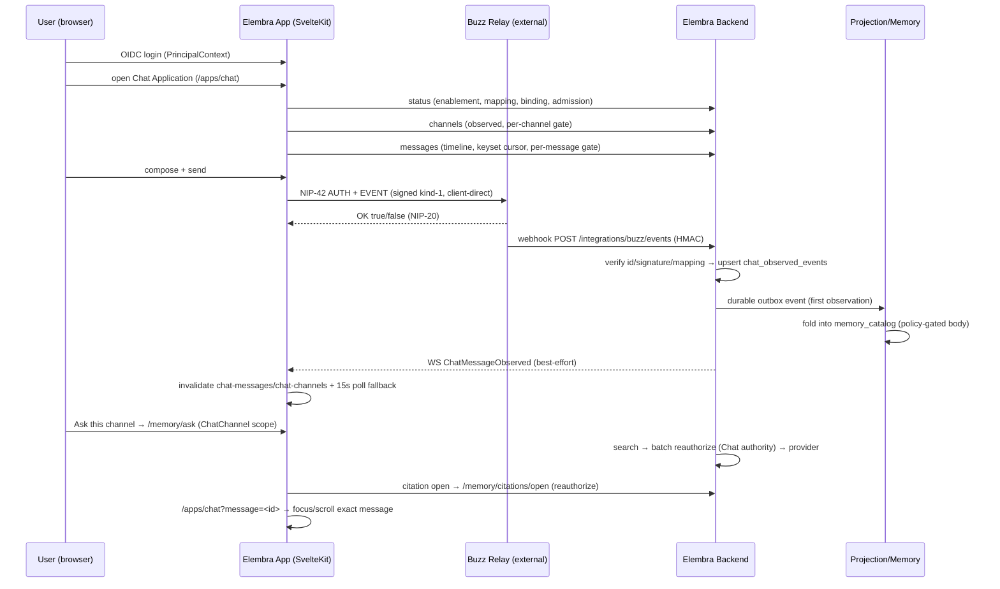
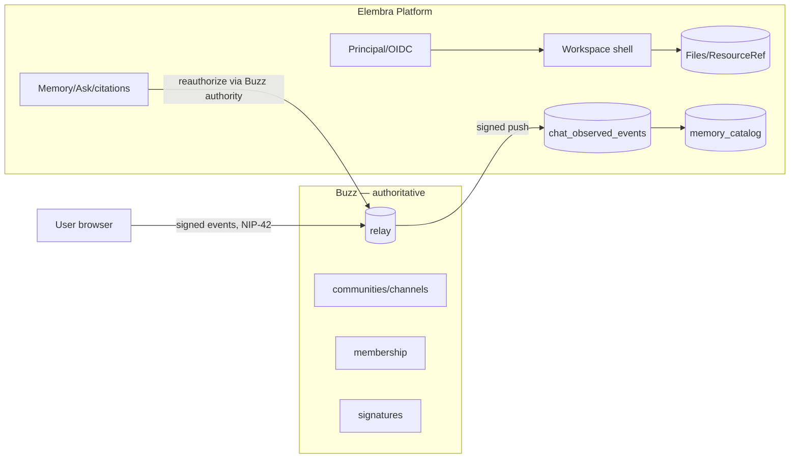

# Elembra Chat Alpha Readiness and Dogfooding

> **Status:** Analysis + small-blocker pass (branch `feat/chat-alpha-readiness`)
> **Scope:** Make the Elembra Chat Application v1 vertical slice suitable for real daily dogfooding. Not Chat v2, not a feature backlog.
> **Base:** `main` @ `a4c8183f` (PR #238 merged — "Elembra Chat Application v1 powered by Buzz")

---

## 1. Current architecture

Elembra Chat v1 (delivered by PR #238) is a read-surface application over an external, authoritative Chat engine:

- **Buzz owns** communities, channels, messages/events, signatures, membership and Chat authorization. Elembra never reads Buzz's private database and never holds a human signing key server-side.
- **Elembra owns** principal/login, the workspace/application shell, Files/ResourceRef, Memory/Search/Ask, product navigation/UX.
- **Writes are client-direct**: the browser holds the user's Buzz key (BIP-340 Schnorr), signs kind-1 events locally, and publishes to the configured relay over a one-off NIP-42 WebSocket session (`frontend/src/lib/chat/nostr.ts`). Elembra adds no send endpoint.
- **Observation is push-only**: Buzz pushes signed events to `POST /api/v1/integrations/buzz/events` (HMAC + replay window + Nostr id/Schnorr verification + community/author mapping), which upserts `chat_observed_events` and publishes the durable outbox event `io.elembra.chat.buzz.event.observed.v1`; a projection consumer folds authorized observations into the Memory catalog (`memory_catalog`).
- **Reads are derived, not stored**: channel list and timeline are queries over the observation index, gated per-message/per-channel through `ChatResourceOwner`; the final authority decision is a live relay `access/check` in `buzz` mode (not yet live upstream) or the coarse workspace-only `local` gate (the default today).
- **Ask/citations reuse the existing pipeline**: `/memory/ask` with `ChatChannel` scope and `/memory/citations/open` reauthorize through the same Chat authority; citations open the exact message via `/apps/chat?message=<id>`.

Contract status: all `v1alpha1`; the upstream relay capability (`access/check`, 9030/9031 admission, channel registry) is **proposed, not yet implemented in the Buzz repository** — until it ships, every deployment runs the `local` gate (ADR-0035).

## 2. Runtime data flow

### Trust boundaries

Boundaries that must never be crossed (ADR-0034/0035, platform invariants):

- no shared Buzz/Elembra schema; no second chat source of truth in Elembra PostgreSQL;
- no server-side custody of human signing keys; OIDC is not permission to impersonate a Buzz key;
- no caching/snapshotting of relay authorization decisions — revocations take effect on the next read;
- no browser-side RAG; no source bodies beyond the authorized read model;
- attachment authorization stays in Files (chat membership alone grants nothing); `elembra-ref` is identifier-only;
- every authority failure fails closed to `Deny`; denied/unknown resolve to existence-hiding 404s.

## 3. Trust boundaries (detailed)

| Boundary | Enforced by | Fail mode |
|---|---|---|
| Tenant/workspace isolation | observation maps `community_id` → exactly one active workspace; `workspace == tenant` invariant; partial unique index prevents a second active mapping | `AmbiguousCommunity` → 409, fail closed |
| Chat read authorization | `ChatResourceOwner` pre-filters (enablement/binding/admission/mapping) + final live authority + post-authority re-read linearization | `Deny`; existence-hiding 404 |
| Revocation | `revoked_at IS NULL` on every decision; post-authority re-read catches a revoke racing the relay decision; disabled principal → DB trigger revokes binding/admission + queues kind-9031 via outbox | next read fails closed |
| Attachments | Files `prepare/preview/open` reauthorize at call time | existence-hiding 404 |
| Ask/citation | `/memory/ask` scope enforced server-side; citation `open` reauthorizes via Chat authority before returning | hidden 404; citations allow-list |
| Signing | key never leaves the browser; composer refuses when local pubkey ≠ bound pubkey | publish refused |

**Residual authorization gap (documented):** Elembra does not verify per-channel membership inside a community at the projection/Ask-candidacy layer — a member admitted to a community can be candidate-exposed for a specific channel whose Buzz-side membership changed. Channel-list/timeline reads ARE gated per-channel through the authority in v1; this gap applies to the coarse community-level gate used for Memory candidacy. Closing it requires the upstream channel-level relay adapter (ADR-0035 follow-up).

## 4. Alpha contract

Definition: **Elembra Chat Alpha** = a workspace can dogfood Chat daily with real Buzz — browse channels, send signed messages, attach Elembra Files, Ask the current channel, open exact-message citations — with honest failure states and no security regressions. Not Slack/Discord/Mattermost parity.

| # | Capability | Pass criterion (measurable) |
|---|---|---|
| A1 | Account/browser key setup | First-time bind: generate key → encrypt (PBKDF2 600k) → NIP-42 challenge → admission queued; UI shows pending state |
| A2 | Key backup/restore | Export copies encrypted envelope; second browser imports it and publishes as the same identity (no re-bind needed) |
| A3 | Channel discovery | Bound+admitted user sees every channel with observed events, gated; channel list refreshes within 15s of a new channel's first message even with WS down |
| A4 | Channel switching | Selecting a channel loads that channel's timeline; cursor/focus never leak across channels |
| A5 | Message history | Timeline shows folded latest-per-message, newest-first; reference-only rows render the explicit placeholder |
| A6 | Pagination | "Load earlier" advances via opaque cursor; same-second messages never skipped; Back-to-latest returns to newest page |
| A7 | Sending | Send publishes a signed kind-1 to the relay and clears the draft only on OK true |
| A8 | Publication acknowledgement | UI distinguishes relay-reachable-but-rejected (with relay reason) from relay-unreachable; a sent message appears in the timeline within ≤15s (WS push or poll) |
| A9 | Relay outage | Publish shows the relay-offline error; reads in `local` mode stay available; `buzz` mode fails closed (documented) |
| A10 | Reconnect | WS reconnect up to 10 attempts with backoff; after exhaustion Chat remains usable via 15s poll (messages AND channels) until reload/login |
| A11 | WS invalidation | Ingest broadcasts `ChatMessageObserved`; message + channel queries invalidate; poll covers the WS-dead case |
| A12 | Projection delay | Message visible ≤15s after relay OK under healthy pipeline; operator can observe lag (webhook rejection logs, dead-letter, lag metric) |
| A13 | Browser reload | Key stays in per-user vault; passphrase re-prompt on next send; deep link re-applies |
| A14 | Logout/login | Vault rescoped per user; second user never inherits the previous user's key |
| A15 | Revocation | Admin/offboarding revocation denies further reads+publish immediately (next read fails closed); UI degrades to empty/safe states |
| A16 | Attachments | Attach via Files prepare → `elembra-ref` tag; open reauthorizes through Files; unauthorized/removed file → 404, never leaks |
| A17 | Ask this Channel | `/memory/ask` with ChatChannel scope returns grounded answers with chat citations only from the selected channel |
| A18 | Exact-message citations | Citation open reauthorizes; navigating lands on and scrolls to the exact message in the owning channel |
| A19 | Cross-tenant isolation | A tenant's chat data never appears in another tenant's channel list/timeline/Ask results |
| A20 | Operator visibility | Every webhook rejection, publish rejection, projection failure, and authorization denial is log-visible with a safe reason |

## 5. Dogfood scenarios

1. **Daily channel conversation**: login → open Chat → switch channels → read history → reply (no threads) → message appears within 15s.
2. **Second-device continuation**: export backup on device A → import on device B → send as the same identity.
3. **File-anchored conversation**: attach an Elembra File → continue the conversation → Ask the channel later → open the citation → open the original message and the attached file.
4. **Company-memory loop** (strategically most important): live communication → observed company memory → Ask this Channel → exact citation → open original message/file.
5. **Failure day**: relay down; webhook secret drift; WS dead; revoked user mid-session — each must degrade honestly and be diagnosable from logs.
6. **Offboarding drill**: disable a principal → immediate read/publish denial; another tenant unaffected.

## 6. Failure-mode matrix

| Failure | Current behavior | Operator-visible today? | Alpha gap |
|---|---|---|---|
| Webhook HMAC/verification rejection | 400/401/403, **silent** | **No** (fixed in this pass: `warn!` per category) | was: message silently never appears |
| Outbox consumer broken/DLQ | dead-letter + retry metrics | Partial (outbox metrics, no chat attribution) | lag metric + per-community health |
| Relay unreachable (publish) | "relay unreachable" banner | No (browser-only) | publish/observation lag telemetry |
| Relay rejects publish | **generic** banner (fixed in this pass: relay reason surfaced) | No | client-side telemetry |
| Admission queued but never delivered | UI unlocks from DB row; relay may reject every publish | **No** | bridge delivery visibility (9030/9031 ack) |
| WS exhausted (10 attempts) | channel list froze (fixed in this pass: poll covers channels) | No | reconnect policy / auto re-init |
| Buzz-mode relay outage | reads fail closed (deny) | warn log per gateway error | read-availability story (upstream) |
| Projection failure | poison → Permanent → DLQ, warn | Yes (warn + DLQ metrics) | alerting |
| Authorization denial | existence-hiding 404, silent drop from timeline | debug logs only | denial counter |
| Revocation mid-session | next read denies; UI silently empties | debug logs only | revocation push to clients |
| Ask without LLM provider configured | 503 "LLM provider not configured" | No | status-surface `ask_available` |
| Citation open on lost access | hidden 404, "That source is no longer available." | No | — |

## 7. Observability requirements (minimum)

Prefer the existing `tracing` + outbox-metrics infra. Minimum useful set for Alpha:

1. **Webhook rejection logging** — every 400/401/403/409/500 with category and safe context (no bodies, no signatures, no keys). **Done in this pass.**
2. **Chat ingestion metrics** — counter per outcome (observed/duplicate/rejected-by-category), observation→projection lag gauge (watermark of latest observed `event_created_at` vs now), per-community ingestion health.
3. **Publish-path telemetry** — relay reachability probe + publish outcome counters (OK/rejected/transport) aggregated server-side from the status/health surface.
4. **Bridge delivery visibility** — expose 9030/9031 outbox consumer state (queued/acked/DLQ) on the chat status/admin surface so "admission looks active but relay never got it" is diagnosable.
5. **Authorization denial counter** — per-tenant denied-read counter (no PII) so offboarding/rotation bugs are visible.
6. **Alert surfaces** — DLQ growth, webhook rejection rate spike, observation-lag threshold.

Items 2–6 are deferred to tracked issues (not implemented in this pass — they are backend/ops work beyond a safe small-fix slice).

## 8. v1 limitation classification

| # | Limitation | Class |
|---|---|---|
| L1 | Channel list = observed events only (no Buzz registry API) | D (upstream dependency) |
| L2 | Reference-first messages render without body (no `content_indexing`) | C (documented posture; opt-in flag) |
| L3 | Buzz-mode large timelines slow (per-message relay round-trips, no batch endpoint) | D (upstream batch endpoint deferred, ADR-0035) |
| L4 | No reply/thread composer (thread tag wire format unconfirmed) | D (upstream wire format) → B when wire confirmed |
| L5 | Attachments sender-side only (observation index keeps no tags) | B (projection change; not Alpha-blocking for senders) |
| L6 | No client channel tagging (channel attribution by Buzz bridge) | D (upstream wire format) |
| L7 | DM/private/excluded channels unreadable under local gate | D (upstream `access/check`) |
| L8 | Device loss without export unrecoverable | B (documented; import/export UX now complete) |
| L9 | No per-channel membership verification at projection/Ask candidacy | D (upstream channel-level adapter) |
| L10 | Observation body never backfilled by re-push/reconcile | C (documented; delete+re-push recovery) |
| L11 | No body for never-eligible channels | C (by design) |
| L12 | Buzz mode not live upstream; all deployments run `local` gate | D (upstream; blocks production buzz authz) |
| L13 | Reconcile skips unbound (revoked) authors | C (documented) |
| L14 | No delegated/service/agent access to Chat | C (fails closed today) |
| L15 | Buzz-mode reads depend on relay availability | D (upstream; fail-closed by design) |
| L16 | 60s `evaluated_at` freshness window assumes clock sync | C (fail-closed on skew) |
| L17 | Plaintext relay transport only for dev (wss required in prod) | C (ops contract) |
| L18 | Reconcile is admin repair, not steady state | C (documented) |
| L19 | WS broadcast is best-effort; poll covers UI | C (now covers channels too) |
| L20 | Relay-offline banner on composer (publish unavailable) | C |
| L21 | Files preview/thumbnail unimplemented (v1alpha1 contract) | B |
| L22 | `list_messages` limit ≤64 matches batch cap 64 | A (audited: consistent at 64) — no change needed |
| L23 | Offboarding delivery async/queued (relay side eventually consistent) | B |
| L24 | Publish-path revocation verified manually only (9030/9031 orchestration) | B (needs relay admin CLI automation) |
| L25 | Webhook 4xx rejections were silent | **A — fixed in this pass** |
| L26 | Channel list froze when WS died (poll covered only messages) | **A — fixed in this pass** |
| L27 | No multi-device key import UI (importChatKey was dead code) | **A — fixed in this pass** |
| L28 | Publish failures undifferentiated ("relay unreachable" for everything) | **A — fixed in this pass** |
| L29 | Composer's status query subscribed lazily; first-send race in isolation | **A — fixed in this pass (prop-based status)** |
| L30 | No server-side revocation endpoint (`revoke_principal` dead code) | B (admin endpoint + UI) |
| L31 | Sent-vs-observed distinction absent ("did my message land?") | B |
| L32 | Ask 503 trap when LLM not configured | B |

Classes: **A** Alpha blocker (fixed in this pass where small) · **B** important but post-Alpha · **C** deliberately deferred · **D** architectural dependency on Buzz/upstream work.

## 9. Required fixes (implemented in this pass)

All four are small, behavior-preserving beyond the intended change, and covered by tests. See the PR diff for this branch.

1. **Webhook rejection logging** (`backend/server/src/handlers/buzz_events.rs`) — every 400/401/403 rejection now emits `warn!` with category + safe reason (no bodies/signatures/keys). Previously only ambiguous-mapping and persistence failures logged, so "why did my message never appear" was invisible.
2. **Channel polling fallback** (`frontend/src/lib/components/chat/ChatApplicationView.svelte`) — the 15s poll now refetches channels (guarded by the same enabled condition as the channels query), so a dead websocket can no longer freeze the channel list.
3. **Multi-device key import/export** (`frontend/src/lib/components/chat/MessageComposer.svelte`) — a bound identity with no local key now gets an inline import UI (backup JSON + passphrase → `importChatKey`), plus a persistent "Export key" affordance. Previously `importChatKey` was dead code and the only export moment was pre-binding.
4. **Publish-result differentiation** (`frontend/src/lib/chat/nostr.ts` + composer) — `publishEvent` now returns `{ok:true} | {ok:false, reason:'transport'|'rejected', detail?}`; the composer shows "relay rejected the message: <relay reason>" vs "relay unreachable". NIP-20 rejection reason is surfaced, not swallowed.
5. **Composer status prop** (`MessageComposer.svelte` + `ChatApplicationView.svelte`) — the composer no longer duplicates the chat-status query; the bound pubkey is passed as a prop from the parent's already-loaded reactive status. This removes a lazy-subscription race where the first send could silently no-op in isolation and stops relying on cross-component query-cache coupling.

## 10. Deferred features (tracked as issues)

- Revocation admin endpoint + offboarding UX (L30).
- Sent-vs-observed message status indicator (L31).
- Chat ingestion/observability metrics + bridge delivery visibility (observability items 2–6).
- Recipient-side attachment tags (projection change, L5).
- Reply/thread composer once the thread wire format is confirmed (L4).
- Ask-availability gating in the status surface (L32).
- Buzz-mode read latency batch endpoint + upstream `access/check`/channel registry (L3/L1/L7/L12/L15 — upstream).
- Reconcile automation for revocations (L24).

## 11. Issue mapping

| Issue | Title | Action |
|---|---|---|
| #196 | [Epic] Evolve RustShare into Elembra… | KEEP (roadmap tracker) |
| #214 | [Application][Chat] Build Elembra Chat bridge around Buzz… | UPDATE — mark v1 delivered by #238; remaining: Buzz bridge outbox consumer (9030/9031 live), channel registry, RustChat retain/migrate/drop |
| #215 | [Application][Chat][Identity] SSO ↔ Buzz key binding, recovery, revocation | UPDATE — binding/admission/rotation/revocation foundation delivered; remaining: import/export UX (partially delivered here), revocation admin endpoint, multi-device story |
| #119 | [Application][Memory] Catalog, search, cited RAG | KEEP |
| #120 | [Application][Deferred] Object Spaces | DEFER (self-declared) |
| #213, #99, #117, #173 | Connector foundation + use cases | KEEP (out of Chat scope) |
| #235 | update: OKF v.2 | DEFER (research/format update; low substance) |
| #236 | [bug] vault obsidian sync endpoint | KEEP (real user bug, Obsidian domain — outside Chat scope) |
| — | *new*: Chat operator observability (webhook rejection logging done; metrics/lag/bridge visibility) | CREATE |
| — | *new*: Revocation admin endpoint + offboarding UX | CREATE |
| — | *new*: Sent-vs-observed message status indicator | CREATE |
| — | *new*: Recipient-side attachment tags (projection) | CREATE |
| — | *new*: Reply/thread composer (blocked on wire format) | CREATE |
| — | *new*: Ask availability gating when LLM provider not configured | CREATE |
| — | *new*: Buzz-mode production readiness (access/check, batch, channel registry — upstream) | CREATE |

No duplicate issues existed; none closed. Existing open issues are narrow; none need a giant "Chat v2" catch-all.

## 12. Alpha exit criteria

Elembra Chat reaches Alpha when all of the following hold:

1. All **A-class** limitations resolved (L25–L29 are fixed in this pass; no remaining A-class items).
2. Alpha contract A1–A20 pass on a daily dogfooding deployment with a **real relay** (not the fake): A1, A2 (two-device), A7, A8, A16, A17, A18 exercised end-to-end by at least two people for ≥1 week.
3. Every failure in the matrix §6 is observable from logs/metrics (webhook rejections, publish outcomes, projection DLQs, authorization denials).
4. Offboarding drill (A15) passes: disabled principal immediately loses read+publish; another tenant verified unaffected.
5. Security proofs from Chat v1 remain green on the dogfooding stack (cross-tenant, revoked binding denies, attachment denial, Ask channel confinement, citation authorization, no private Buzz DB reads, no second source of truth).
6. Buzz-mode authorization is either live upstream with a conformance suite (ADR-0035 acceptance) or explicitly documented as gated behind the `local` coarse gate for the dogfooding period.
7. Known B-class limitations are tracked as issues with owners; none is silently forgotten.

**Verdict (current):** NOT YET Alpha — the vertical slice is functionally complete and security-green, but the four small blockers fixed in this pass (silent webhook rejections, frozen channel list under WS death, no multi-device key import, undifferentiated publish failures) plus the missing operator observability and revocation endpoint keep it below the bar. The path is short: implement the observability + revocation issues, then run a real-relay two-device dogfooding week.

## Recommended next GOAL

**Elembra Chat Alpha hardening** — implement the six new issues from §11 (observability first, then revocation endpoint, then sent-vs-observed), stand up a real-relay dogfooding deployment, and run the Alpha contract A1–A20 checklist for one week with at least two people. Do NOT start Chat v2 (threads UI, DM surfaces, Slack parity) until the Alpha exit criteria hold.

---

## 13. Dogfooding deployment findings (this goal)

A reproducible Alpha deployment was built and exercised against a real Buzz
relay (this goal, PR in review). Findings that update the picture above:

### New runtime component: observation bridge

The upstream Buzz relay has **no webhook delivery** — nothing pushes events to
Elembra's observation endpoint. A real dogfooding deployment therefore needs a
small relay→Elembra forwarder:
`frontend/scripts/buzz-observer.mjs` (NIP-42 AUTH as the bridge identity, NIP-01
REQ for kind-1, HMAC push to `POST /api/v1/integrations/buzz/events`). Elembra's
webhook remains the authoritative verifier; the bridge only relays. This is the
missing runtime half of the "push-only observation" contract (§1) — track its
hardening (durable cursor, retries, supervision) in the operator-observability
issue (#239-adjacent).

### Local-relay mapping was impossible (fixed)

`validate_relay_url` applied the SSRF guard unconditionally, so a relay on
`localhost`/private addresses could not be mapped via the admin API, and the
binding challenge re-validated the stored URL — blocking local dogfooding
entirely. Fixed with `RUSTSHARE_CHAT_ALLOW_LOCAL_RELAY` (default `false`),
mirroring `RUSTSHARE_ALLOW_INTERNAL_MAIL_SERVERS`. Public relays are unaffected.

### Other observed behaviors

- The mapping is **existence-hidden** until a binding exists (`chat_status`
  returns `mapping: null` without a binding) — provisioning flows must PATCH
  first, not rely on the status field.
- Channel attribution is bridge-side (client publishes no channel tag): the
  observer routes on a `channel` tag when present, else a configured default.
- Revocation works end-to-end: admin disable denies Elembra reads immediately;
  relay-side 9031 denies further publishes. The admin *endpoint* (#240) remains
  a UX/automation follow-up.
- Ask without an LLM provider returns 503 "LLM provider not configured" — the
  L32/#244 trap is real on a fresh deployment.
- CSRF (double-submit cookie) applies to all authenticated mutating API calls;
  API tooling must echo `X-Rustshare-Csrf` (browsers do automatically).
